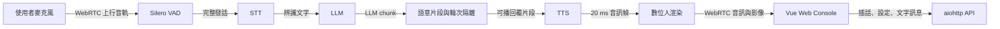

# Nova Avatar

Real-time full-duplex conversational digital human framework.

Nova Avatar 以 WebRTC 串起語音辨識、LLM、語音合成與數位人渲染，提供免按
對話、串流回覆、輪次隔離與可切換 Avatar 引擎的即時互動體驗。

> Nova Avatar 是獨立維護的衍生專案，最初源自
> Kedreamix/Linly-Talker-Stream。上游與第三方 attribution 詳見
> [`NOTICE`](NOTICE) 及 [`THIRD_PARTY_NOTICES.md`](THIRD_PARTY_NOTICES.md)。

## Overview

系統由伺服器單獨擁有完整的「對話輪次」：Silero 判定使用者說完後，後端完成
STT，將 LLM chunk 切成可播回覆片段，再依序交給 TTS 與 Avatar。文字、音訊與
影格攜帶 `turn_id`、generation 與 sequence；插話或斷線後，舊輪次資料會在各
輸出邊界被拒絕。

可直接用瀏覽器開啟 [`docs/project-overview.html`](docs/project-overview.html)
查看架構圖；已交付能力、驗證證據與執行邊界記錄於
[`docs/project-status.md`](docs/project-status.md)。

目前工作項目與過往實驗的清理流程請見
[`docs/current-project-workflow.md`](docs/current-project-workflow.md)；可選引擎、
外部 runtime 與商業審查邊界請見 [`docs/software-stack.md`](docs/software-stack.md)。

## Features

- 全雙工 WebRTC 音訊與影像傳輸，支援免按對話、按住說話與按鍵插話。
- 可靠回覆語音串流：LLM 尚未完成全文時，完整語意片段即可開始合成與播放。
- 端到端輪次隔離、取消柵欄、播放提交、字幕同步與有界媒體背壓。
- Silero 服務端串流 VAD；瀏覽器只傳輸音訊，不自行切段。
- 可切換 Whisper／FunASR、Ollama／llama.cpp 與多種無金鑰 TTS 引擎。
- MuseTalk 段落邊界與回答收尾的嘴型連續控制，不以延遲音訊換取平滑。
- Web Console 可管理模型、角色、Prompt、回覆規則、字幕與看板版面。
- 所有麥克風音訊預設只存在短生命週期的記憶體緩衝；除非使用者明確錄製，
  系統不持久保存原始收音。

## Architecture



```text
nova-avatar/
├── config/                 # 服務、模型、語音、VAD 與 Prompt 設定
├── docs/                   # ADR、狀態、架構與授權說明
├── scripts/                # 安裝、模型下載、憑證、驗證與啟動腳本
├── src/
│   ├── asr/                # STT 介面、工廠與引擎
│   ├── avatars/            # Avatar 介面、素材與渲染引擎
│   ├── config/             # YAML schema、載入與設定持久化
│   ├── llm/                # 對話、歷史、Prompt、規則與回覆協定
│   ├── server/             # aiohttp、WebRTC、API、輪次與串流管線
│   ├── tts/                # TTS 介面、佇列與引擎
│   ├── utils/              # 共用路徑、日誌與 WebRTC 工具
│   └── vad/                # Silero 串流端點偵測
├── tests/                  # Python 測試
└── web/                    # Vue Web Console 與 Node 測試
```

## Supported Engines

| 類型 | 引擎 | 發行定位 |
| --- | --- | --- |
| STT | faster-whisper、FunASR | 依實際版本與模型條款使用 |
| LLM | Ollama、llama.cpp | 本機 OpenAI-compatible 服務 |
| TTS | Edge TTS、GPT-SoVITS、XTTS、CosyVoice、Fish TTS、IndexTTS2 | 選用；逐一核對服務、聲音與模型條款 |
| Avatar | MuseTalk | 支援；MIT code，可用於商業整合，但模型與依賴另行核對 |
| Avatar | Wav2Lip | **選用；Research / Non-commercial** |
| Avatar | UltraLight、ER-NeRF、TalkingGaussian | 選用；發行前核對各自程式、模型與資料集條款 |

Wav2Lip 的 engine identifier 仍為 `wav2lip`，但這只是技術識別字，不代表 Nova
Avatar 將其重新授權。上游公開版不可用於商業用途。

## Quick Start

### Requirements

- Linux
- Python 3.10 或 3.11；自動安裝腳本使用 Python 3.10.19
- [`uv`](https://docs.astral.sh/uv/)
- Node.js、npm、FFmpeg
- NVIDIA GPU 與相容 CUDA 環境（建議）

### Install

預設以 MuseTalk 作為一般安裝範例：

```bash
git clone https://github.com/s0966066980/nova-avatar.git
cd nova-avatar
bash scripts/setup-env.sh musetalk
bash scripts/download_musetalk_weights.sh
```

手動安裝核心依賴：

```bash
uv venv --python 3.10.19
uv sync --extra vad
cd web
npm install
cd ..
```

遠端瀏覽器使用麥克風通常需要安全來源。開發環境可先產生本機憑證：

```bash
bash scripts/create_ssl_certs.sh
```

### Run

```bash
bash scripts/start-all.sh config/config.yaml
```

預設入口：

- Web Console：`https://localhost:3000`
- 後端健康檢查：`https://localhost:8010/health`
- 後端日誌：`logs/start-all-backend.log`

若 LLM provider 設為 `llamacpp`，後端會按需啟動 `llama-server`。正常停止時只
清理由本程式啟動並持有的程序，不會終止外部管理的服務。

## Configuration

主要設定檔是 [`config/config.yaml`](config/config.yaml)，也可在 Web Console 的
「設定」面板修改。Avatar、STT 或 TTS 切換前需先中斷目前 WebRTC 會話；設定
API 會先驗證模型或引擎，成功後才更新執行中狀態並寫回 YAML。

| 分類 | 可調整內容 | 套用注意事項 |
| --- | --- | --- |
| LLM | provider、模型、預設 Prompt、規則與回覆字數 | 影響後續對話輪次 |
| Avatar | 引擎、角色與嘴型參數 | 有進行中會話時不可切換 |
| 回覆模式 | 舊有／串流 | 下一輪生效 |
| VAD／STT | 門檻、發話邊界、模型、語言、裝置 | 引擎切換前先中斷會話 |
| TTS | 引擎、聲音、模型、語言、說話者與裝置 | 先實際試聽再保存 |

## Web Console

Web Console 提供即時演播、文字對話、TTS 朗讀、路由測試與完整設定中心。獨立
舞台入口為 `/stage.html`，可呈現 Avatar、舞台字幕、浮動看板與麥克風控制。

重新品牌化後的 localStorage keys 使用 `nova-avatar-*`。前端首次載入會讀取並
遷移舊版 keys，以保留既有語言、介面與編輯器高度設定。

## Streaming Reply Pipeline

| 路徑 | LLM 輸出 | 交付時機 | 現況 |
| --- | --- | --- | --- |
| 串流模式 | 逐 chunk 接收並依語意邊界切片 | 可播回覆片段形成後立即排入有界管線 | Edge TTS＋MuseTalk 已通過正式 SLO；預設關閉 |
| 舊有模式 | 等待完整 LLM 回覆 | 全文一次排入後續流程 | 保留跨引擎相容性 |

兩種模式共用字幕、播放與錯誤恢復保證。串流契約包含 generation fence、取消後
零 stale output、音訊主時鐘、首個非靜音音訊提交字幕／history，以及有限媒體
債務。詳見 [ADR-0007](docs/adr/0007-stream-replies-with-turn-isolation-and-audio-clock.md)。

## Testing & Validation

```bash
uv sync --group dev
uv run python scripts/check-integration.py
uv run pytest
cd web
npm test
npm run build
```

`check-integration.py` 預設只做離線的設定、品牌、授權與 release 文件檢查。
在目前 YAML 指向的 LLM 與 Edge TTS 已經可用時，才執行實際服務 smoke check：

```bash
uv run python scripts/check-integration.py --smoke
```

該命令不會寫入音檔；需要保留 Edge TTS 輸出時才加上
`--output logs/tts_check.mp3`。

需要驗證 Edge TTS＋MuseTalk 的真實 WebRTC 流程時：

```bash
uv run python scripts/run_voice_soak.py \
  --base-url https://localhost:8010 \
  --turns 50 \
  --output .scratch/reply-voice-streaming/real-soak-report.json
```

## Commercial Usage

Nova Avatar 自行撰寫的 Apache-2.0 程式與 MuseTalk 的 MIT 程式可用於商業整合，
但這不會授予任何第三方模型、權重、資料集、聲音或服務的權利。

**Wav2Lip 公開版為 Research / Non-commercial，禁止商業使用。商業發行版不得
bundle 或啟用本 repository 內的 Wav2Lip 程式與其上游權重。** TalkingGaussian
及其他選用引擎也必須逐項完成授權審查，不能只依賴根目錄 Apache-2.0 LICENSE。

本節是專案維護資訊，不構成法律意見。

[`config/config_commercial.yaml`](config/config_commercial.yaml) 提供以 MuseTalk、
faster-whisper、Silero、本機 OpenAI-compatible LLM 與 Edge TTS 為起點的商業審查
設定檔。它不會自動驗證或授予模型、權重、聲音、資料集或外部服務的商業權利；
部署前仍須依 [`docs/software-stack.md`](docs/software-stack.md) 與
[`THIRD_PARTY_NOTICES.md`](THIRD_PARTY_NOTICES.md) 逐項核對。

## Third-Party Components

第三方程式、模型、權重與資料集不會因整合進 Nova Avatar 而被重新授權。完整
角色、來源、license 與限制清單請閱讀
[`THIRD_PARTY_NOTICES.md`](THIRD_PARTY_NOTICES.md)，並保留隨附的第三方 license。

## References and Attribution

This project was originally derived from Kedreamix/Linly-Talker-Stream and has
since been substantially redesigned and independently maintained.

Relevant upstream and third-party projects include:

- [Kedreamix/Linly-Talker-Stream](https://github.com/Kedreamix/Linly-Talker-Stream)
- [LiveTalking](https://github.com/lipku/LiveTalking)
- [MuseTalk](https://github.com/TMElyralab/MuseTalk)
- [Wav2Lip](https://github.com/Rudrabha/Wav2Lip)
- [Whisper](https://github.com/openai/whisper)
- [FunASR](https://github.com/modelscope/FunASR)

See [`NOTICE`](NOTICE) and [`THIRD_PARTY_NOTICES.md`](THIRD_PARTY_NOTICES.md)
for licensing details.

## License

Nova Avatar 的專案程式採用 [Apache License 2.0](LICENSE)。適用的上游 copyright
與 attribution 均保留；第三方元件仍受各自條款約束。
